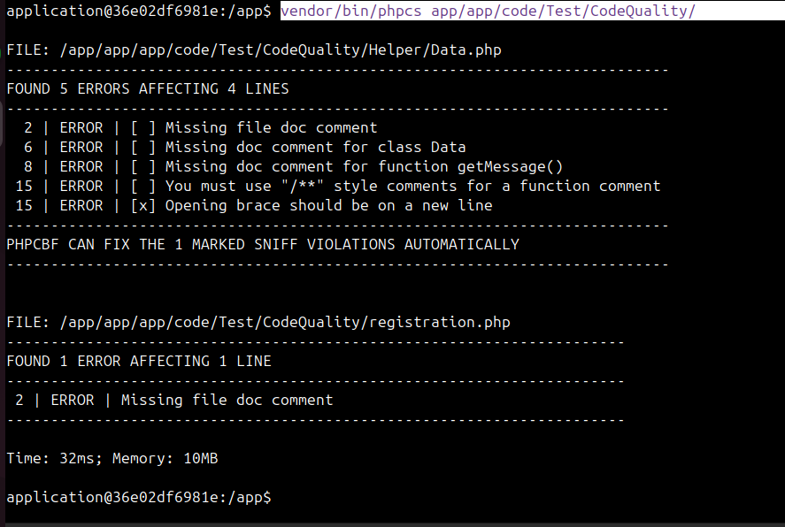
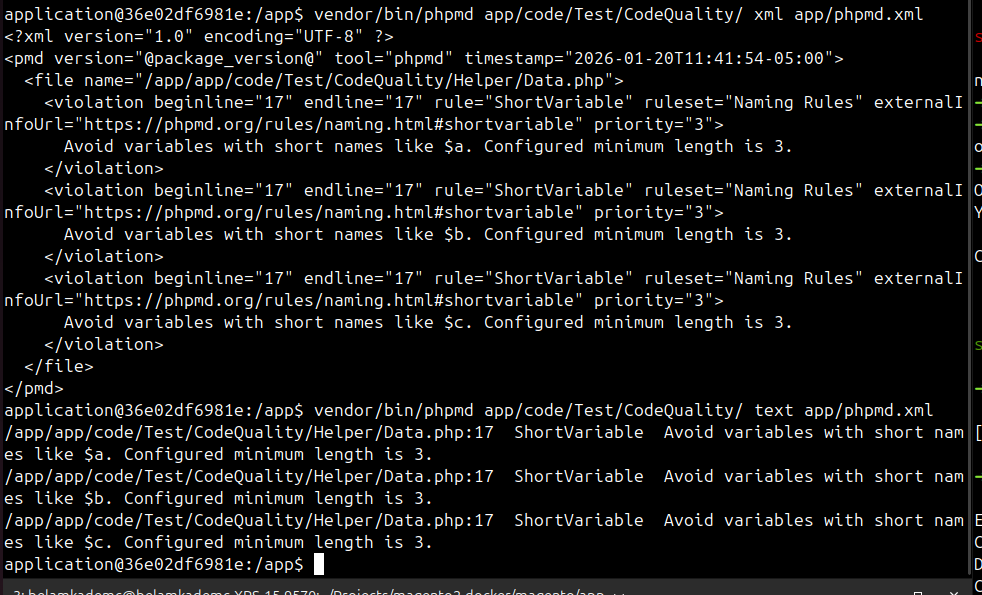
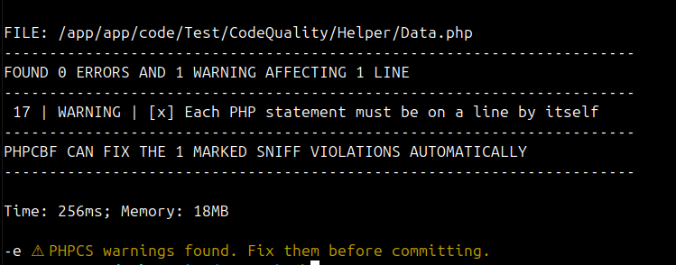
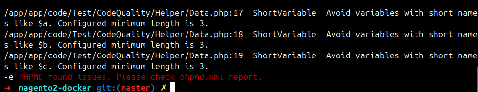
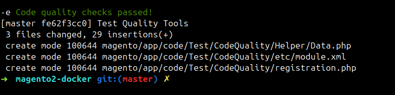
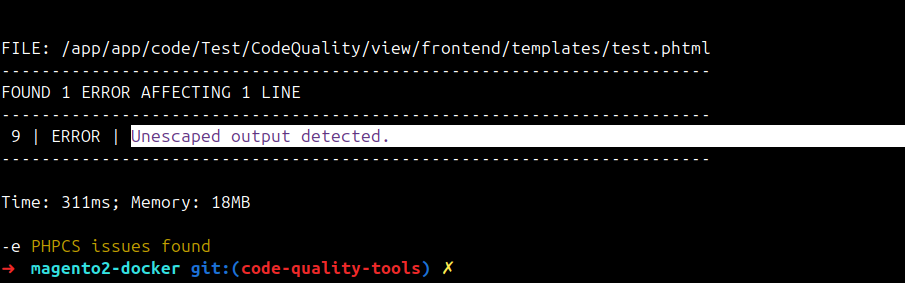

## Integrate code quality tools

doc : https://www.mgt-commerce.com/tutorial/magento-2-code-quality-tools/

### Step 1: Install PHP_CodeSniffer (PHPCS) & Magento Coding Standard

📌 Definition:

PHPCS checks HOW your code is written,
It enforces coding standards (formatting & style).

🎯 Role (What it checks)

PHPCS focuses on style & syntax rules, such as:

- Indentation (spaces / tabs)

- Line length

- Braces placement `{ }`

- Spaces around operators

- File & class docblocks format

- Naming style (camelCase, PascalCase)

- Use of strict_types

Install via Composer:

```
composer require --dev squizlabs/php_codesniffer
composer require --dev magento/magento-coding-standard
```

Configure PHPCS to use Magento standard:

```
vendor/bin/phpcs --config-set installed_paths vendor/magento/magento-coding-standard
```

Verify installation:
```
vendor/bin/phpcs -i
```
Test your code:
```
vendor/bin/phpcs app/code/Test/CodeQuality/
```
🔧 Auto-fix support

✅ YES – AUTO FIXABLE

PHPCS comes with PHPCBF (Code Beautifier & Fixer)

```
vendor/bin/phpcbf --standard=Magento2 app/code/Test/CodeQuality/
```

This will automatically fix:

- Spacing

- Indentation

- Braces

- Some docblock formatting

❌ It will NOT fix:

- Business logic

- Bad variable names

- Long methods

**`phpcs`** : Detect coding standard violations

**`phpcbf`** : Auto-fix fixable violations
```
vendor/bin/phpcbf --standard=Magento2 app/code/Test/CodeQuality/ > fix-report.txt
```
`fix-report.txt` will show what was fixed and what remains.



### Step 2: Set Up PHP Mess Detector (PHPMD)

PHPMD finds potential bugs, unused code, long methods, and other maintainability issues.


PHPMD checks **WHAT your code does**, It detects design & logic problems.

🎯 Role (What it checks)

PHPMD focuses on code quality & maintainability, such as:

- Long methods

- God classes (One class = many responsibilities)

A God class usually has:

❌ Too many methods

❌ Too many properties

❌ High complexity

❌ Handles unrelated logic

❌ Hard to test

❌ Hard to maintain

- Too many parameters

- Short variable names `$a = 1;`

- Unused variables

- High complexity

- Dead code

- Poor design patterns

---

**🔧 Auto-fix support**

❌ NO AUTO FIX

**PHPMD never modifies code.**

**Why?** Because fixing design issues requires human decisions.

PHPMD is `analysis-only`.

Install PHPMD:
```
composer require --dev phpmd/phpmd
```
option 1 : Use PHPMD with “built-in ruleset names”
```
vendor/bin/phpmd app/code/Test/CodeQuality/ text codesize,unusedcode,design,naming
```
No XML files needed, PHPMD will apply all standard checks.

Option 2: Create your own custom ruleset XML
Create a ruleset configuration (phpmd.xml):
```
ls
app  autoload.php  bootstrap.php  design  etc  phpmd.xml
```
```
<?xml version="1.0" encoding="UTF-8"?>
<ruleset name="testCode PHPMD rule set"
         xmlns="http://pmd.sf.net/ruleset/1.0.0"
         xmlns:xsi="http://www.w3.org/2001/XMLSchema-instance"
         xsi:schemaLocation="http://pmd.sf.net/ruleset/1.0.0
                     http://pmd.sf.net/ruleset_xml_schema.xsd"
         xsi:noNamespaceSchemaLocation="
                     http://pmd.sf.net/ruleset_xml_schema.xsd">
    <description>testCode PHPMD rule set</description>
    <rule ref="rulesets/cleancode.xml" />
    <rule ref="rulesets/codesize.xml" />
    <rule ref="rulesets/controversial.xml" />
    <rule ref="rulesets/design.xml" />
    <rule ref="rulesets/naming.xml" />
    <rule ref="rulesets/unusedcode.xml" />
</ruleset>
```

Run PHPMD:

result xml format
```
vendor/bin/phpmd app/code/Test/CodeQuality/ xml app/phpmd.xml
```

result text format
```
vendor/bin/phpmd app/code/Test/CodeQuality/ text app/phpmd.xml
```



Analyze results

PHPMD will output warnings/errors such as:

- Methods that are too long

- Variables that are declared but never used

- Complex class structures

---

### Step 3: Set Up ESLint for Frontend JS

Fix frontend errors to improve user experience quality.

This ensures frontend performance meets quality standards.

ESLint = code quality + style checker for JavaScript

It checks:
- Bad JS patterns

- Bugs

- Performance issues

- Inconsistent style

Install ESLint:
```
npm install eslint --save-dev
```

---

### Step 4: Configure Pre-Commit Hooks

**Role:** This catches errors before commits.

1- Go to your project’s `.git/hooks/` folder.

```
cd .git/hooks/
```

2- Create pre-commit file:

```
nano pre-commit
```
Add:
```
#!/bin/sh
git diff --cached --name-only | grep '\.php$' | xargs vendor/bin/phpcs --standard=Magento2
```
3- Make it executable:
```
chmod +x pre-commit
```
This will block commits if PHPCS finds violations.

vim pre-commit:
```
#!/bin/sh
# Pre-commit hook: PHP code quality checks for Magento2
# Runs PHPCS and PHPMD using the XML rulesets

RED='\033[0;31m'
YELLOW='\033[0;33m'
GREEN='\033[0;32m'
NC='\033[0m'

# Get staged PHP and PHTML files
FILES=$(git diff --cached --name-only --diff-filter=ACM | grep -E '\.(php|phtml)$')
[ -z "$FILES" ] && exit 0

# Map to container paths
CONTAINER_FILES=""
for f in $FILES; do
    CONTAINER_FILE=${f#magento/}   # Remove local prefix if needed
    CONTAINER_FILES="$CONTAINER_FILES /app/$CONTAINER_FILE"
done

# PHPCS
echo "🐳 Running PHPCS..."
docker exec -u application web bash -lc \
"cd /app && vendor/bin/phpcs --standard=/app/app/phpcs.xml --extensions=php,phtml $CONTAINER_FILES"
if [ $? -ne 0 ]; then
    echo -e "${YELLOW}PHPCS issues found${NC}"
    exit 1
fi

# PHPMD (only PHP files)
PHP_FILES=$(echo "$FILES" | grep '\.php$')
if [ -n "$PHP_FILES" ]; then
    CONTAINER_PHP_FILES=""
    for f in $PHP_FILES; do
        CONTAINER_FILE=${f#magento/}
        CONTAINER_PHP_FILES="$CONTAINER_PHP_FILES /app/$CONTAINER_FILE"
    done

    echo "🐳 Running PHPMD..."
    docker exec -u application web bash -lc \
    "cd /app && vendor/bin/phpmd $CONTAINER_PHP_FILES text /app/app/phpmd.xml"
    if [ $? -ne 0 ]; then
        echo -e "${RED}PHPMD issues found${NC}"
        exit 1
    fi
fi

echo -e "${GREEN}✔ Code quality checks passed${NC}"
exit 0
```
> 

> 

> 

phtml check:

> 

```
#!/bin/sh

RED='\033[0;31m'
YELLOW='\033[0;33m'
GREEN='\033[0;32m'
NC='\033[0m'

FILES=$(git diff --cached --name-only --diff-filter=ACM | grep -E '\.(php|phtml)$')
[ -z "$FILES" ] && exit 0

PHP_FILES=$(echo "$FILES" | grep '\.php$')
PHTML_FILES=$(echo "$FILES" | grep '\.phtml$')

CONTAINER_FILES=""
for f in $FILES; do
CONTAINER_FILE=${f#magento/}
CONTAINER_FILES="$CONTAINER_FILES /app/$CONTAINER_FILE"
done

echo "🐳 Running PHPCS..."
docker exec -u application web bash -lc \
"cd /app && vendor/bin/phpcs --extensions=php,phtml $CONTAINER_FILES"
[ $? -ne 0 ] && echo -e "${YELLOW}PHPCS issues found${NC}" && exit 1

if [ -n "$PHP_FILES" ]; then
CONTAINER_PHP_FILES=""
for f in $PHP_FILES; do
CONTAINER_FILE=${f#magento/}
CONTAINER_PHP_FILES="$CONTAINER_PHP_FILES /app/$CONTAINER_FILE"
done

echo "🐳 Running PHPMD..."
docker exec -u application web bash -lc \
"cd /app && vendor/bin/phpmd $CONTAINER_PHP_FILES text /app/phpmd.xml"
[ $? -ne 0 ] && echo -e "${RED}PHPMD issues found${NC}" && exit 1
fi

echo -e "${GREEN}✔ Code quality checks passed${NC}"
exit 0
```

Make PHPCS ALWAYS use your config:

vendor/bin/phpcs --config-set default_standard app/phpcs.xml

Verify:

vendor/bin/phpcs --config-show | grep default_standard

To see the exact sniff name being triggered:

vendor/bin/phpcs -s app/code/Test/CodeQuality/Helper/Data.php

---

Install SlevomatCodingStandard:

If you want strict_types, class/function naming, docblocks, you need to install it:
```
composer require --dev slevomat/coding-standard
```
```
vendor/bin/phpcs --config-set installed_paths vendor/slevomat/coding-standard,vendor/magento/magento-coding-standard
```
```
vendor/bin/phpcs -i

The installed coding standards are MySource, PEAR, PSR1, PSR2, PSR12, Squiz, Zend, SlevomatCodingStandard, Magento2 and Magento2Framework
```
---

### Step 5: Automate Checks in CI/CD


